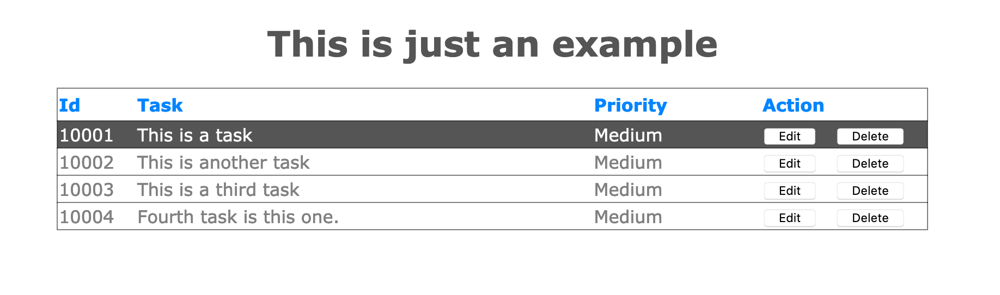

# Simple table.html

UI : 



Styles : 
```
body {
    width: 1024px;
    margin: 0 auto;
    font-family: Verdana, Geneva, Tahoma, sans-serif;
}

.main-text {
    text-align: center;
    color: #555555;
}

.main-table {
    width: 800px;
    border-spacing: 0;
    border-collapse: collapse;
    margin: 0 auto;
    color: gray;
}

.main-table th {
    text-align: left;
    color: #0084ff;
}

.main-table tr {
    border: 1px solid #00000080;
}

.main-table thead tr {
    height: 30px;
}

.main-table tbody tr:hover {
    cursor: pointer;
    color:white;
    background-color:#555555
}

.main-table-id-column {
    width: 70px;
}

.main-table-action-column {
    width: 150px;
}
```

